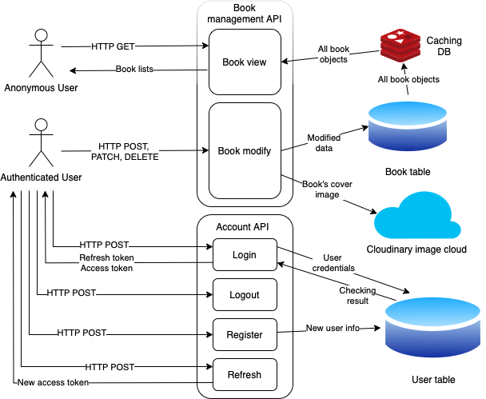
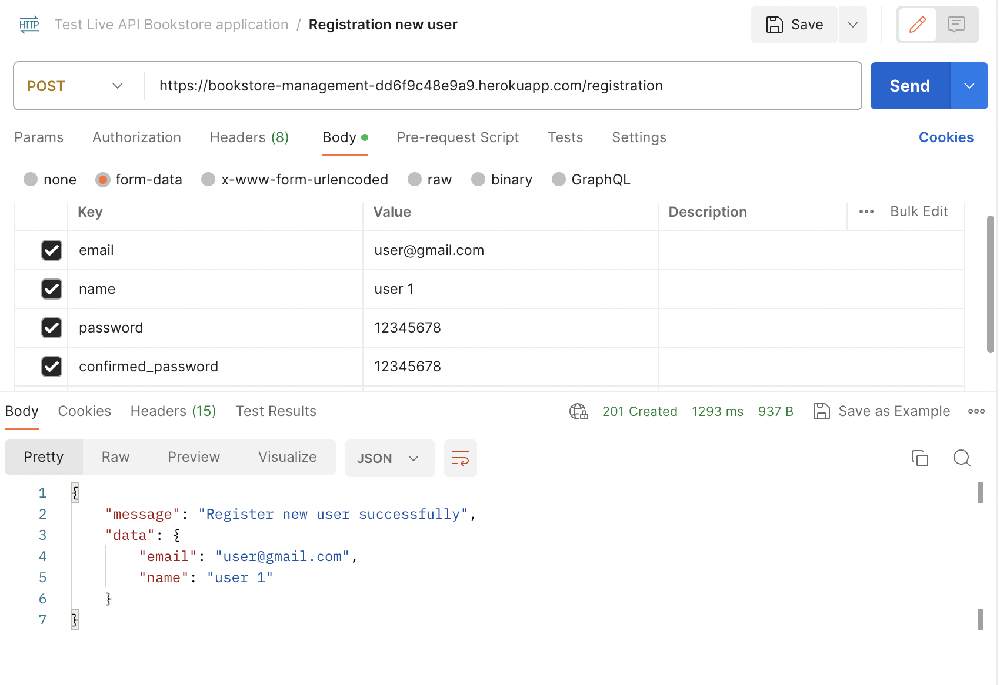
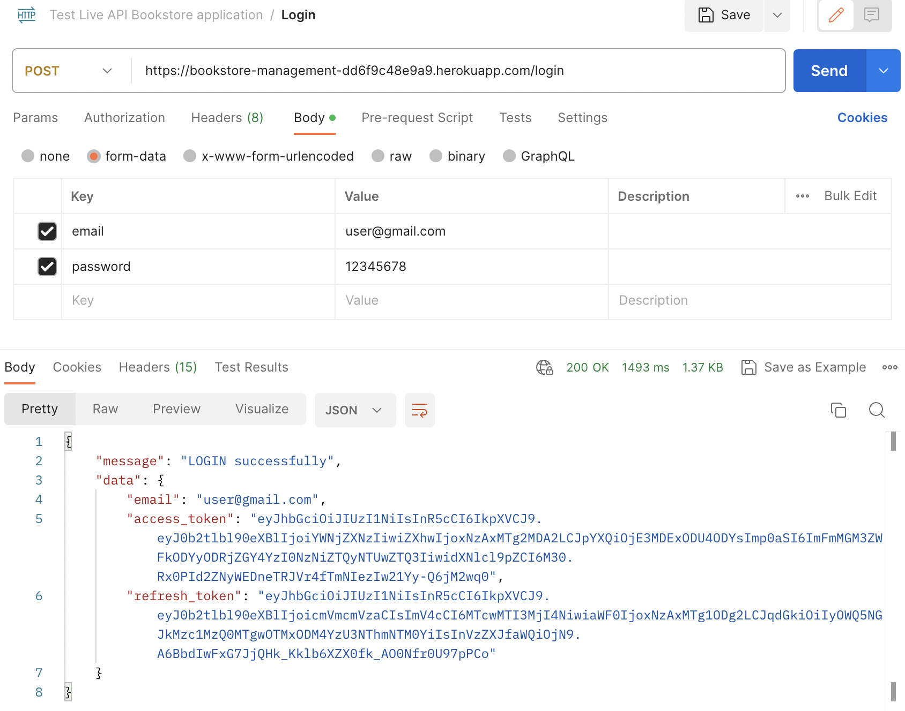

# Bookstore Management Application

This is the repo of a simple bookstore management application written in **Python language**, using **Django Framework**, with simple CRUD functions. It also includes authentication functions for user to register and login.

This is an RESTful API application. I use the **Django Rest Framework** to implement the serialization part of the response. All functions, from authentication to CRUD, are handled through RESTful API. We can use API platform like Postman or Swagger, or use the Django REST framwork web interface to interact with this application.

## Application functions:

- This is a RESTful API application, all the functions must be done through API. No templates are used, even for login or registration functions.
- The application has a book model with the following field:
  - ID (primary key)
  - Title
  - Author
  - Publish date
  - ISBN
  - Price
  - Book's cover cloud public ID
  - Book's cover public url
- The application allows user:
  - Retrieve all avalable books in the store. We can get books by ID, search books by author or title. We can also get book by paginator (by giving the specific book per page and the page we want). This function is for all people, so it **doesn't require LOGIN**.
  - Create new book for the store. If we don't specify the book cover, the application automatically assign the empty cover image to it. This function is for user only, so it **require LOGIN**.
  - Update the book content. We can update fully or partially. This function is for user only, so it **require LOGIN**.
  - Delete the book with the specific ID. This function is for user only, so it **require LOGIN**.
- For LOGIN the system, you must follow these steps:
  - First, create a user account by specifying 4 fields:
    - Email as username
    - Full name
    - Password
    - Confirmed password
  - After checking the password and confirmed password match, the application will create a new user with username is your email, and password.
  - Then, when you want to LOGIN, you must send the email and password for authenticating.
  - The application then sends a refresh token and an access token for user to do the authentication when create, update or delete a book.
  - The access token has the timeout of 2 minutes, so you must send the refresh token to the application for receiving a new access token.
  - When you LOGOUT, send back the refresh token to the application for blacklisting.

## System design:



This is the overall design for the system of the application.

### Application structure:

The Django application is divided into 2 seperated apps:

- **Book management** app has dealing with CRUD functions for the main book model.
- **Account** app has dealing with authentication functions.
- Details of each API is described in the **API function** part.

### Database choosing:

As this is a simple application, we just have 2 tables, so the database is not complicated.

- When the application run locally, I prefer using **SQLite3** database for easy testing.
- When the application run on deployment environment, I prefer using **PostgresSQL** for a production database.

### Authentication:

I use JWT as the method to authenticate users. The `simple_jwt` library is used to implement this. The timeout setting for access token is 2 minutes.

### Image cloud service:

As my application allows user to upload book's cover images, saving images in database is not a good idea. Therefore, I use an multi-media storage service called [**Cloudinary**](https://cloudinary.com) in order to save the image.

### Caching:

I use Redis as the caching server for the application when running locally. I only cache all the book objects when the anonymous users call GET request.

### Rate limiting:

I use the throttling function of **Django Rest Framework** in order to limit the access of a certain user. I limit the anonymous user to 10 accesses per minute.

### CORS header:

I include the CORS headers app inside my application, so other Front-end applications can call the API from my application.

## API functions:

### Authentication:

- **Registration**:
  - Usage:
    - You need to specfify **email** as username, your **full name**, your **password** (at least 8 characters), and **confirmed password** to the registration request in order to register new user. The new user data is saved to the `User` table for later `login`
  - Method allowed: `POST`
  - API url: `/registration`
  - Contenttype: `application/json`
  - Authorization: No need
  - Body:
  ```json
  {
    "email": "test@gmail.com",
    "name": "test",
    "password": "12345678",
    "confirmed password": "12345678"
  }
  ```
  - Return:
    - `201` with email, full name and a message to confirm creating new user successfully.
    - `400` for any request missing information, or wrong email format, or wrong confirmed password
- **Login**:
  - Usage:
    - You need to provide the correct user name and password for login. As I use **JWT token** for later authorization, the login request return a pair of token: `access_token` and `refresh_token`.
  - Method allowed: `POST`
  - API url: `/login`
  - Contenttype: `application/json`
  - Authorization: No need
  - Body:
  ```json
  {
    "email": "test@gmail.com",
    "password": "12345678"
  }
  ```
  - Return:
    - `200` for login successfully, with a message and 2 tokens: `access_token` and `refresh_token`. You should save these 2 tokens for later use. Currently, I set the timeout for `access_token` by **2 minutes**, so you need to refresh it every **2 minutes**.
    - `404` if you enter the wrong `email` or `password`
- **Logout**:

  - Usage:
    - This request is used to **blacklist** the `refresh_token` of logout users. You must `login` before you could `logout`, so after you `logout`, you need to `login` again to get new **tokens**.
  - Method allowed: `POST`
  - API url: `/logout`
  - Contenttype: `application/json`
  - Authorization: `Bearer  <access_token>`
  - Body:

  ```json
  {
    "refresh_token": "refresh_token"
  }
  ```

  - Return:
    - `200` for logout successfully
    - `400` for sending wrong `refresh_token`

- **Refresh access token**:
  - Usage:
    - This request is used for getting the `access_token` every time it is **timeout**. Currently the timeout is every **2 minutes**.
  - Method allowed: `POST`
  - API url: `/refresh`
  - Contenttype: `application/url`
  - Authorization: `Bearer  <access_token>`
  - Body:
  ```json
  {
    "refresh_token": "refresh_token"
  }
  ```
  - Return:
    - `200` for refreshing successfully, and the new `access_token`
    - `400` for sending wrong `refresh_token`

### CRUD:

- **GET books list**:

  - Usage:
    - This request is used to get a list of Book objects. All the objects are paginated for Front-end using, with the number of objects perpage requested by user.
    - User can choose the page to return, or the server would return the first page by default. If the page does not exist, an empty object list would be returned.
    - User can also GET the book by specifying the book's ID.
    - This request also supports searching part of author or title.
    - The response includes: `id`, `title`, `author`, `publish_date`, `ISBN`, `price`. It also provides the `url` to the book cover image to let user to GET the image.
  - Method allowed: `GET`
  - API url: `/`
  - Contenttype: `application/json`
  - Request parameters:
    - `?id=0`
    - or `?limit=2&page=1&key=author1`
  - Authorization: No need
  - Body: No need
  - Return:

    - `200` for succesfully GET item. We also return a list of Book objects' serializers that satisfies the request parameteres. Each object contains the following field:

      - `id`
      - `title`
      - `author`
      - `publish_date`
      - `ISBN`
      - `price`
      - `image_url`

      The request also returns `total_items` as the number of items that can get, and `total_pages` as the number of pages that is created by `Paginator`. If the page we want is out of range, we will return an empty object list.

    - `404` for the ID of the book that does not exist.

- **Modifying books data**:

  - **POST method**:

    - Usage:
      - This request is used to create a new book in the database. The fields required: `title`, `author`, `publish_date`, `ISBN`, `price`.
      - There is one optional field, which is `image`. This is the image file of the cover of the book. The application then uploads the image to **Cloudinary**, and store the `public ID` as well as the `image url`. If user don't specify the image, empty image url would be stored.
      - The `id` of the new item is created by automatically increasing.
    - Method allowed: `POST`
    - API url: `/books`
    - Contenttype: `application/json`
    - Request parameters: No need
    - Body:

    ```json
    {
      "title": "test title",
      "author": "test author",
      "publish_date": "2023-02-03",
      "ISBN": "123-12-123",
      "price": 12.0,
      "image": Image FILE
    }
    ```

    - Return:
      - `201` for succesfully POST item. If user uploads a new image, the response time is slow as the request needs to finish uploading to **Cloudinary** before response.
      - `400` for the request missing any fields above.

  - **PATCH method**:

    - Usage:
      - This request is used to update the data of an existed book in the database. We can update **partially** instead of **fully** update.
      - When updating the `image` field, the old image in **Cloudinary** is deleted, the new one is uploaded. The `image ID` and `url` in database are updated
    - Method allowed: `PATCH`
    - API url: `/books`
    - Contenttype: `application/json`
    - Request parameters:`?id=0`
    - Authorization: `Bearer  <access token>`
    - Body (partially):

    ```json
    {
      "title": "test title",
      "author": "test author",
      "publish date": "2023-02-03",
      "ISBN": "123-12-123",
      "price": 12.0,
      "image": Image FILE
    }
    ```

    - Return:
      - `201` for succesfully PATCH item. If user uploads a new image, the response time is slow as the request needs to finish uploading to **Cloudinary** before response.
      - `400` for the request with missing `id` or wrong names of any fields above.
      - `404` for the request with `id` that doesn't exist.

  - **DELETE method**:
    - Usage:
      - This request is used to delete an existed book in the database. The book cover in **Cloudinary** is also deleted if it is not the empty cover.
    - Method allowed: `DELETE`
    - API url: `/books`
    - Contenttype: `application/json`
    - Request parameters:`?id=0`
    - Authorization: `Bearer  <access token>`
    - Body: No need
    - Return:
      - `204` for succesfully DELETE item. The response time is slow as the request needs to finish deleting in **Cloudinary** before response.
      - `400` for the request with missing `id`.
      - `404` for the request with `id` that doesn't exist.

## Deployment:

### Live API:

I have deployed the application to Heroku. This is the url: [https://bookstore-management-dd6f9c48e9a9.herokuapp.com](https://bookstore-management-dd6f9c48e9a9.herokuapp.com). You can use this url to test the API with Postman or Swagger.

### Locally setup:

If you want to run my code locally for testing, please follow the following steps:

_Before you run any `python3 manage.py + [command]`, remember to `cd` to the `bookstore` folder as it is the father folder of `manage.py`._

1. Clone the project with the command:
   ```sh
   git clone https://github.com/ThanhDuonghcmut/Bookstore-Management.git
   ```
2. Create a virtual environment for the project.
3. Install the required library from `requirements.txt` file
   ```python
   pip3 install -r requirements.txt
   ```
4. Create a `.env` file inside the `Bookstore-Management` folder. You can change the fields in my `env.txt` file with your custom value, then change its file name into `.env`:
   - With `SECRET_KEY` field, you can give it any key you want.
   - With `DEBUG` field, you can set it as True or False, depending on this is for testing or production.
   - With the 3 fields: `CLOUDINARY_CLOUD_NAME`, `CLOUDINARY_API_KEY`, `CLOUDINARY_API_SECRET`, you need to create a **Cloudinary** account, and pass your own **Cloudinary** credentials into these fields.
   - With the 3 fields: `EMPTY_IMAGE_PUBLIC_ID`, `EMPTY_IMAGE_URL`, `CLOUDINARY_FOLDER`, it depends on the empty image you upload to your **Cloudinary** cloud, and the folder you want to upload all of your applications' image.
   - With the field `LOCAL_SQLITE`, you can set to `True` to use the built-in **SQLite3** database of **Django**, or set to `False` to use your external database.
   - With the 5 fields: `DB_NAME`, `DB_HOST`, `DB_USER`, `DB_PASSWORD`, `DB_PORT`, it depends on the database you want to choose. If you use the built-in **SQLite3** database, you can ignore these fields.
   - With the field `LOCAL_REDIS`, you can set to `True` to use your local Redis server, or set to `False` to use your external Redis server.
   - With the 4 fields `REDIS_USERNAME`, `REDIS_PASSWORD`, `REDIS_URL`, `REDIS_DB` you can specify the Redis credentials you want to use. If you use local Redis server, you can ignore these 4 fields.
5. You can change the default throttling rate and the CACHE TTL into your favorite value in `settings.py`. Please note that the CACHE TTL is in seconds.
6. After all the changes, you can run the following commands to create the database:
   ```python
   python3 manage.py makemigrations
   python3 manage.py migrate
   ```
7. You run the following command to run the local server:

   ```python
   python3 manage.py runserver
   ```

8. You can use Postman, Swagger or your web browser directly to test the APIs. The local url is: [http://localhost:8000](http://localhost:8000)

## Testing:

### API Testing:

I use Postman to test the Live API deployed on **Heroku**. Steps to test API:

1. View book list:
   [https://bookstore-management-dd6f9c48e9a9.herokuapp.com](https://bookstore-management-dd6f9c48e9a9.herokuapp.com)
   
2. Registration new user:
   [https://bookstore-management-dd6f9c48e9a9.herokuapp.com/registration](https://bookstore-management-dd6f9c48e9a9.herokuapp.com/registration)
   
3. Login with credentials:
   [https://bookstore-management-dd6f9c48e9a9.herokuapp.com/login](https://bookstore-management-dd6f9c48e9a9.herokuapp.com/login)
   
   We should save the `access token` for later requests authentication, and `refresh token` for later refreshing for new `access token`.
4. Post new book:
   [https://bookstore-management-dd6f9c48e9a9.herokuapp.com/books](https://bookstore-management-dd6f9c48e9a9.herokuapp.com/books)
   
   We must add the `access token` to `Authorization header` before calling the request.
   
5. Update book content:
   [https://bookstore-management-dd6f9c48e9a9.herokuapp.com/books](https://bookstore-management-dd6f9c48e9a9.herokuapp.com/books)
   
   We must add the `access token` to `Authorization header` before calling the request.
   
6. Delete book:
   [https://bookstore-management-dd6f9c48e9a9.herokuapp.com/books](https://bookstore-management-dd6f9c48e9a9.herokuapp.com/books)
   
   We must add the `access token` to `Authorization header` before calling the request.
7. Refresh token:
   [https://bookstore-management-dd6f9c48e9a9.herokuapp.com/refresh](https://bookstore-management-dd6f9c48e9a9.herokuapp.com/refresh)
   
   This method must be called every **2 minutes**, as that is the current token timeout. You could change it in `settings.py`

   ```python
   SIMPLE_JWT = {
    'ACCESS_TOKEN_LIFETIME': timedelta(minutes=2),
    'AUTH_HEADER_TYPES': ('Bearer',)
    }
   ```

   When we get new `access token`, we should save it for later usage.

8. Logout:
   [https://bookstore-management-dd6f9c48e9a9.herokuapp.com/logout](https://bookstore-management-dd6f9c48e9a9.herokuapp.com/logout)
   
   We must add the `access token` to `Authorization header` before calling the request.

### Unit Testing:

All the test cases for the views and models are written in the tests folder of each app. To run the test cases, we first `cd` to the `/bookstore` folder. Then we run the following commands:

```python
python3 manage.py test accounts
python3 manage.py test bookstore_management
```
